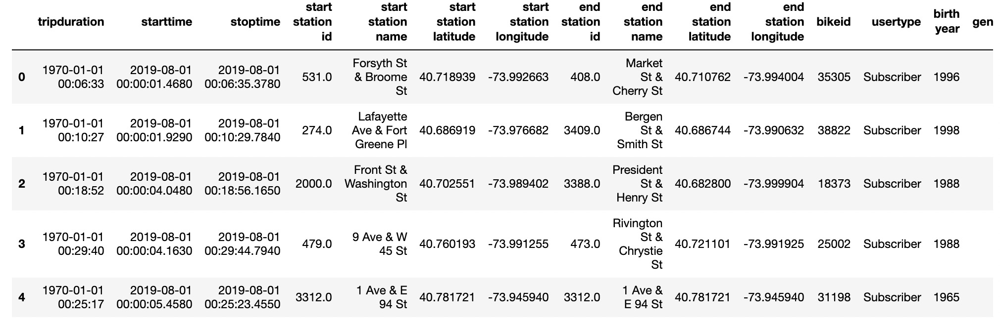
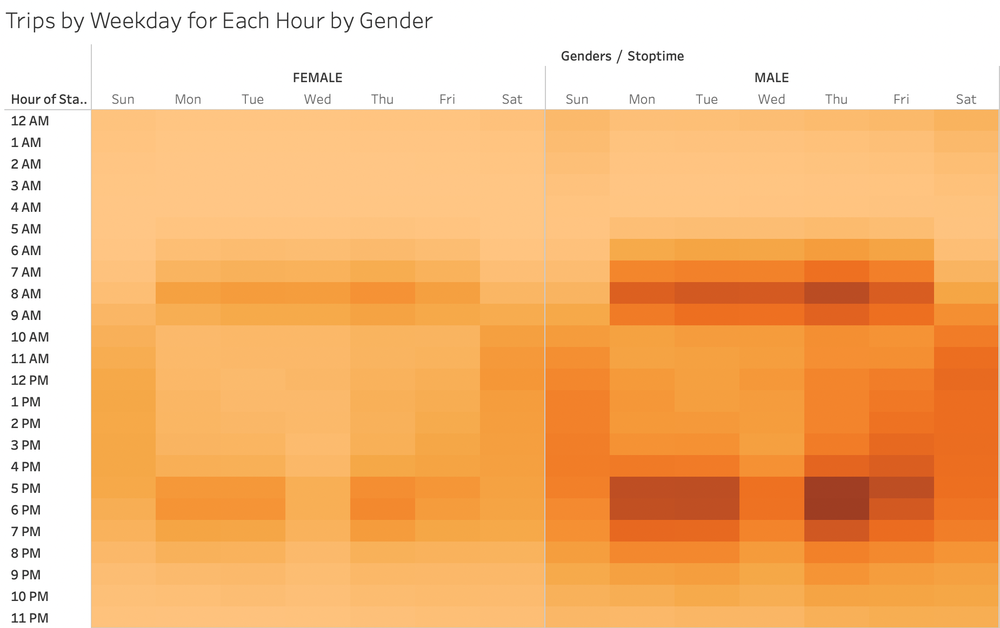

# CitiBike Bikesharing Analysis

***Prepared for Kate - 2021APR04***

## Overview

Des Moines is the next location for CitiBike Bikesharing services, and prior to the launch an analysis of the publicyl available bikeshare data msut be completed to ensure bike stations are placed appropriately, maintenance is performed at a conveneient time, and there are enough bikes.

Provided was Bikesharing data from CitiBike spanning across the month of August in 2019.

An analysis of the CitiBike Bikesharing data was completed using Tableau. Prior to this, the raw data was reviewed and the duration of any bike checkouts was converted to a proper ***datetime*** format (see image below):

Additionally, the **GENDERS** column data was formatted into a string as shown below:

## Results

## Summary

### Conclusion

In conclusion:
* 

### Additional Visualizations

Additional visualizations that can be used to help understand the data includes the following:
* Map of most common START locatons
* Map of most common STOP locations
Having the above visualizations would help determine where to place CitiBike Stations (see images below where BLUE are START locations and ORANGE are STOP locations)

